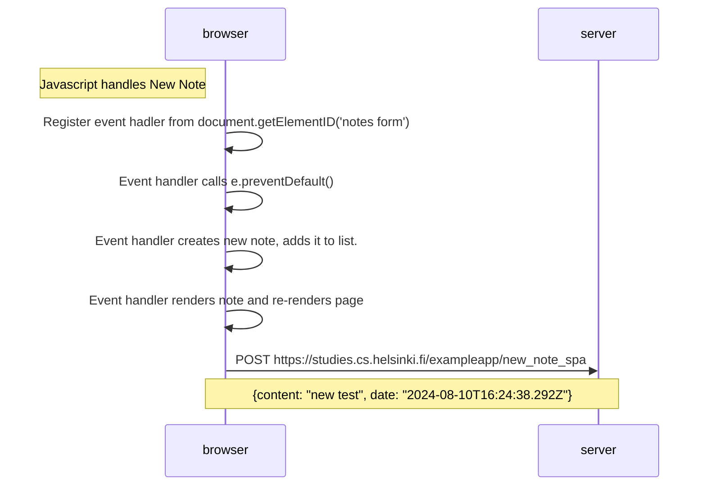

```mermaid
sequenceDiagram
participant browser
participant server

Note left of browser: Javascript handles New Note
browser->>browser: Register event hadler from document.getElementID('notes form')
browser->>browser: Event handler calls e.preventDefault()
browser->>browser: Event handler creates new note, adds it to list.
browser->>browser: Event handler renders note and re-renders page
browser->>server: POST https://studies.cs.helsinki.fi/exampleapp/new_note_spa
Note over browser,server: {content: "new test", date: "2024-08-10T16:24:38.292Z"}

```